# Content Censorship Toggle - Implementation Guide

## ✅ What Was Implemented

A complete UI toggle system that allows broadcasters to enable/disable real-time content censorship **before** starting their stream.

### Features Added:

1. **Pre-Broadcast Configuration Screen**
   - Shows before connecting to LiveKit room
   - Toggle switch for enabling/disabling censorship
   - Visual explanation of what gets censored
   - "Start Broadcast" button triggers stream setup

2. **Censorship Status Indicator**
   - "🛡️ Censorship Active" badge appears in broadcast header
   - Only shown when censorship is enabled
   - Visible to broadcaster during live stream

3. **Backend Integration**
   - Calls `/stream/start` endpoint with `options.enableCensorship` parameter
   - RunPod GPU service only activated when censorship is enabled
   - Per-stream censorship control (overrides global ENABLE_CENSORSHIP setting)

---

## 🔄 How It Works

### User Flow:

```mermaid
sequenceDiagram
    Broadcaster->>Client UI: Selects room & name
    Client UI->>Broadcaster: Shows censorship toggle
    Broadcaster->>Client UI: Toggles censorship ON/OFF
    Broadcaster->>Client UI: Clicks "Start Broadcast"
    Client UI->>Backend: POST /stream/start {enableCensorship: true/false}
    Backend->>RunPod: Initialize censorship session (if enabled)
    RunPod-->>Backend: Session ID
    Backend-->>Client UI: Stream started, censorship status
    Client UI->>Backend: POST /token {role: broadcaster}
    Backend-->>Client UI: Access token
    Client UI->>LiveKit: Connect with token
    Client UI->>Broadcaster: Shows "🛡️ Censorship Active" (if enabled)
```



### Code Flow:

1. **Client ([client/src/Broadcaster.jsx](client/src/Broadcaster.jsx:228)):**
   ```javascript
   const [enableCensorship, setEnableCensorship] = useState(true);
   const [censorshipActive, setCensorshipActive] = useState(false);
   ```

2. **Start Broadcast Button Click ([client/src/Broadcaster.jsx](client/src/Broadcaster.jsx:393)):**
   ```javascript
   // Calls /stream/start with censorship preference
   const streamResponse = await fetch(`${SERVER_URL}/stream/start`, {
     body: JSON.stringify({
       roomName,
       broadcasterName: participantName,
       options: { enableCensorship }
     })
   });

   // Store censorship status from response
   setCensorshipActive(streamData.censorship?.enabled || false);
   ```

3. **Backend ([server/streamManager.js](server/streamManager.js:62)):**
   ```javascript
   const enableCensorship = options.enableCensorship !== false;

   if (enableCensorship) {
     const processingResult = await processingBridge.startProcessing(
       roomName,
       censorshipConfig
     );
   }
   ```

4. **Processing Bridge ([server/services/processingBridge.js](server/services/processingBridge.js:49)):**
   ```javascript
   // Initialize censorship session in RunPod
   const censorshipResult = await censorshipProcessor.initializeCensorship(
     roomName,
     censorshipConfig
   );
   ```

5. **RunPod Service ([runpod-service/main.py](runpod-service/main.py)):**
   ```python
   # Loads ML models and creates session
   # - Keras-OCR for text detection
   # - NudeNet for NSFW detection
   # - Whisper for audio transcription
   # - OpenCV for object tracking
   ```

---

## 📋 Environment Variables

### Required in [server/.env](server/.env):

```env
# LiveKit Configuration
LIVEKIT_WS_URL=wss://your-project.livekit.cloud
LIVEKIT_API_KEY=your_api_key
LIVEKIT_API_SECRET=your_api_secret
PORT=3001

# RunPod GPU Service
RUNPOD_SERVICE_URL=https://your-runpod-instance.proxy.runpod.net
ENABLE_CENSORSHIP=true  # Global toggle (UI toggle overrides per-stream)
```

**Important:** Remove trailing slash from `RUNPOD_SERVICE_URL`!

---

## 🧪 Testing the Toggle

### 1. Start Both Servers:

**Terminal 1 - Backend:**
```bash
cd server
npm start
```

**Terminal 2 - Frontend:**
```bash
cd client
npm run dev
```

### 2. Test Censorship Enabled:

1. Navigate to [http://localhost:3000](http://localhost:3000)
2. Click "Start as Broadcaster"
3. Enter room name and your name
4. **Ensure toggle is ON** (blue, switched to right)
5. Click "Start Broadcast"
6. Wait for connection
7. **Verify "🛡️ Censorship Active" badge appears** in broadcast header
8. Show prohibited content to camera (e.g., text with profanity, NSFW content)
9. **Expected:** Content gets blurred in real-time

### 3. Test Censorship Disabled:

1. Navigate to [http://localhost:3000](http://localhost:3000)
2. Click "Start as Broadcaster"
3. Enter room name and your name
4. **Toggle OFF** (gray, switched to left)
5. Click "Start Broadcast"
6. **Verify NO "🛡️ Censorship Active" badge appears**
7. Show prohibited content to camera
8. **Expected:** Content passes through uncensored

---

## 🔍 Server Logs to Check

### When Censorship Enabled:

```
[StreamManager] Starting stream for room: test-room
[ProcessingBridge] Starting processing for test-room
[CensorshipProcessor] Initializing censorship for test-room
[CensorshipProcessor] Session created: abc123 for test-room
[StreamManager] Censorship enabled for test-room
```

### When Censorship Disabled:

```
[StreamManager] Starting stream for room: test-room
[StreamManager] Censorship disabled for test-room (skipping processing setup)
```

---

## 📊 API Response Format

### POST /stream/start

**Request:**
```json
{
  "roomName": "my-stream",
  "broadcasterName": "John Doe",
  "options": {
    "enableCensorship": true
  }
}
```

**Response (Censorship Enabled):**
```json
{
  "success": true,
  "roomName": "my-stream",
  "room": { /* LiveKit room object */ },
  "censorship": {
    "enabled": true,
    "sessionId": "abc123",
    "rtmpUrl": "rtmp://...",
    "streamKey": "..."
  },
  "orchestration": { /* processor results */ }
}
```

**Response (Censorship Disabled):**
```json
{
  "success": true,
  "roomName": "my-stream",
  "room": { /* LiveKit room object */ },
  "censorship": {
    "enabled": false
  },
  "orchestration": { /* processor results */ }
}
```

---

## 🎨 UI Components

### Censorship Toggle (Configuration Screen)

Location: [client/src/Broadcaster.jsx](client/src/Broadcaster.jsx:307)

Features:
- Toggle switch (blue when ON, gray when OFF)
- Explanation text: "Automatically detect and blur inappropriate content..."
- Details panel (shows what gets detected when enabled)
- Smooth animations

### Censorship Status Badge (Live Stream Header)

Location: [client/src/Broadcaster.jsx](client/src/Broadcaster.jsx:58)

Features:
- Shows "🛡️ Censorship Active" when enabled
- Purple/blue color scheme
- Positioned next to viewer count
- Only visible when `censorshipActive === true`

---

## 🚀 Next Steps

1. **Add Censorship Stats Display:**
   - Show detection count in real-time
   - Display frame processing rate
   - Add censorship event log

2. **Mid-Stream Toggle:**
   - Allow enabling/disabling during broadcast
   - Call `/censorship/processing/:roomName` endpoint
   - Update UI without disconnecting

3. **Censorship Presets:**
   - "Strict" - Blur everything suspicious
   - "Moderate" - Balance between safety and user experience
   - "Custom" - Fine-tune confidence thresholds

4. **Analytics Dashboard:**
   - Total detections per stream
   - Most common violation types
   - Processing latency metrics

---

## 🐛 Troubleshooting

### Issue: "RunPod service: OFFLINE ❌"

**Cause:** Backend can't reach RunPod service

**Fix:**
1. Check `RUNPOD_SERVICE_URL` has no trailing slash
2. Verify RunPod instance is running
3. Test endpoint: `curl https://your-runpod-url/health`

### Issue: Toggle doesn't affect censorship

**Cause:** Old code cached or stream already started

**Fix:**
1. Fully refresh browser (Ctrl+Shift+R)
2. Restart backend server
3. Check server logs for "Censorship enabled/disabled" messages

### Issue: "Failed to start stream"

**Cause:** Backend not running or CORS issue

**Fix:**
1. Verify backend running on port 3001
2. Check `VITE_SERVER_URL` in client/.env
3. Look for CORS errors in browser console

---

## 📝 Code Changes Summary

### Modified Files:

1. **[client/src/Broadcaster.jsx](client/src/Broadcaster.jsx)**
   - Added `enableCensorship` and `censorshipActive` state
   - Created configuration screen with toggle
   - Added "Start Broadcast" button handler
   - Added censorship status badge to broadcast header

2. **[server/.env](server/.env)**
   - Fixed trailing slash in `RUNPOD_SERVICE_URL`

3. **[server/processors/contentCensorshipProcessor.js](server/processors/contentCensorshipProcessor.js)**
   - Added `dotenv.config()` at top to load env vars

### No Changes Needed:

- [server/streamManager.js](server/streamManager.js) - Already supports `options.enableCensorship`
- [server/services/processingBridge.js](server/services/processingBridge.js) - Already handles conditional censorship
- [runpod-service/main.py](runpod-service/main.py) - Works as-is

---

## ✅ Success Criteria

- [ ] Toggle appears before broadcast starts
- [ ] Toggle default state is ON
- [ ] Clicking "Start Broadcast" calls `/stream/start` with correct preference
- [ ] Backend logs show "Censorship enabled" or "Censorship disabled"
- [ ] Censorship badge appears/disappears based on toggle
- [ ] RunPod service only contacted when censorship enabled
- [ ] No errors in browser console
- [ ] No errors in server console
- [ ] Stream works with censorship ON
- [ ] Stream works with censorship OFF

---

**Implementation Date:** October 2, 2025
**Status:** ✅ Complete and Ready for Testing
